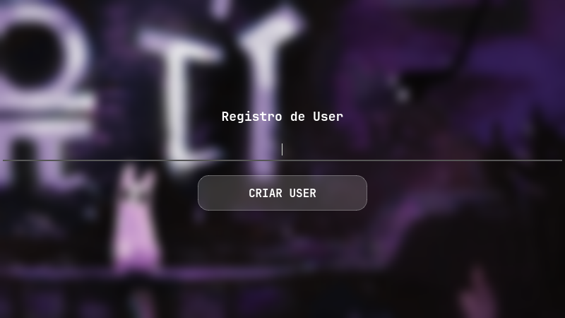
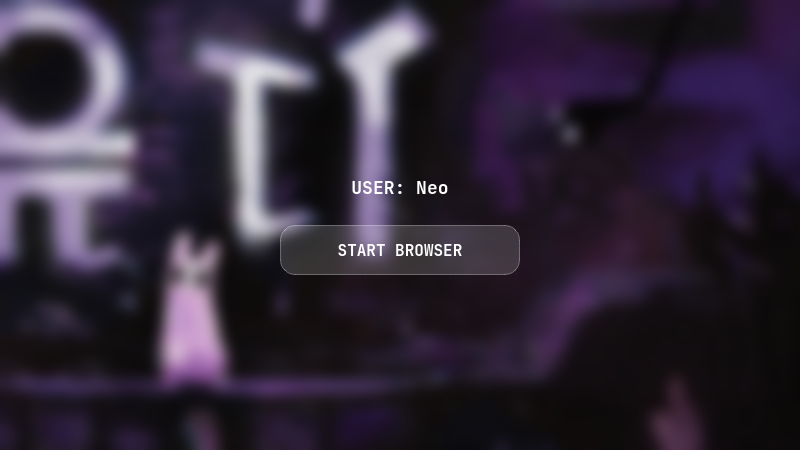
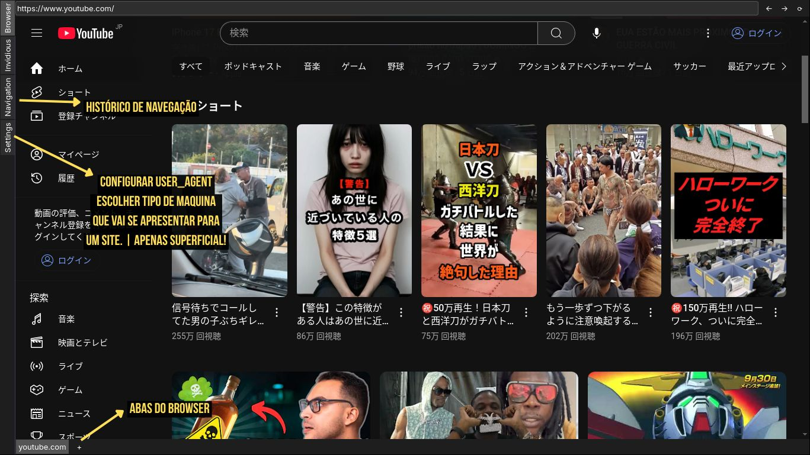

<div align="center">
  
</div>

<h1 align="center">Pac22 Browser</h1>

# Baseado em ( PySide6 + Qt Engine )

## Instalação de dependências
<p>
<b>| Recomendado uso do Python3 |</b>
</p>


- <b>Arch / Manjaro</b>

Git clone
```bash
git clone https://github.com/danrleyof/pac22-browser.git
```

Instala pacotes do sistema
```bash
sudo pacman -S python-pip python-pillow stem qt6-base qt6-webengine
```

Cria e ativa virtualenv
```bash
python -m venv venv
source venv/bin/activate
```

Instala dependências Python
```bash
pip install PySide6 tldextract
```

Roda o browser
```bash
python3 app.py
```
<br>

- <b>Debian / Ubuntu</b>

Git clone
```bash
git clone https://github.com/danrleyof/pac22-browser.git
```

Instala pacotes do sistema
```bash
sudo apt install python3-pip python3-venv qt6-base-dev qt6-webengine-dev libqt6webengine6
```

Cria e ativa virtualenv
```bash
python3 -m venv venv
source venv/bin/activate
```

Instala dependências Python
```bash
pip install PySide6 tldextract
```

Roda o browser
```bash
python3 app.py
```
<br>

- <b>Windows</b>

Atualmente, o projeto é compatível com o Windows.
No entanto, pode haver lentidão durante o uso, pois não há implementação de drivers específicos para o sistema, sendo que o processamento é realizado diretamente pelo CPU.
<br>
Melhorias futuras podem incluir suporte a drivers nativos para otimizar desempenho no Windows.

<br>

## Novo usuário:

- <b>Telas de Registro:</b>
<div align="center"></div>
<div align="center"></div>
<div align="center"></div>

<br>

## Browser:

<div align="center"></div>


<div align="center">

**User Agent**
</div>

<div align="justify">

I started programming at the age of 15, creating projects for fun on FiveM servers. At 19, `I served in the Army in the IT field`, which helped me gain discipline and practical experience. The following year, I enrolled in `Software Engineering at the North University of Paraná (UNOPAR)`, fully diving into the world of programming.

Today, my focus is on `Back-End Development`, where I get to work with logic, structure, and performance — things I truly enjoy. In my free time, `I like exploring cybersecurity` and participating in `bug bounties`, always looking to learn and challenge myself.

</div>

```bash
#  We ship every day - use the latest version!
uv pip install browser-use
```

Download chromium using playwright's shortcut:

```bash
uvx playwright install chromium --with-deps --no-shell
```

Create a `.env` file and add your API key. Don't have one? Start with a [free Gemini key](https://aistudio.google.com/app/u/1/apikey?pli=1).

```bash
GEMINI_API_KEY=
```

Run your first agent:

```python
from browser_use import Agent, ChatGoogle
from dotenv import load_dotenv
load_dotenv()

agent = Agent(
    task="Find the number of stars of the browser-use repo",
    llm=ChatGoogle(model="gemini-flash-latest"),
    # browser=Browser(use_cloud=True),  # Uses Browser-Use cloud for the browser
)
agent.run_sync()
```

Check out the [library docs](https://docs.browser-use.com) and [cloud docs](https://docs.cloud.browser-use.com) for more settings.


## Stealth Browser Infrastructure

Want to bypass Cloudflare, or any other anti-bot protection?

Simply go to [Browser Use Cloud](https://docs.cloud.browser-use.com) grab a `BROWSER_USE_API_KEY` and use the `use_cloud` parameter.

```python
from browser_use import Agent, Browser, ChatOpenAI

# Use Browser-Use cloud browser service
browser = Browser(
    use_cloud=True,  # Automatically provisions a cloud browser
)

agent = Agent(
    task="Your task here",
    llm=ChatOpenAI(model='gpt-4.1-mini'),
    browser=browser,
)
```


# Demos

[Task](https://github.com/browser-use/browser-use/blob/main/examples/use-cases/shopping.py): Add grocery items to cart, and checkout.

[](https://www.youtube.com/watch?v=L2Ya9PYNns8)

<br/><br/>


[Task](https://github.com/browser-use/browser-use/blob/main/examples/use-cases/find_and_apply_to_jobs.py): Read my CV & find ML jobs, save them to a file, and then start applying for them in new tabs, if you need help, ask me.

https://github.com/user-attachments/assets/171fb4d6-0355-46f2-863e-edb04a828d04

<br/><br/>

See [more examples](https://docs.browser-use.com/examples) and give us a star!


<br/><br/>
## MCP Integration

This gives Claude Desktop access to browser automation tools for web scraping, form filling, and more. See the [MCP docs](https://docs.browser-use.com/customize/mcp-server).
```json
{
  "mcpServers": {
    "browser-use": {
      "command": "uvx",
      "args": ["browser-use[cli]", "--mcp"],
      "env": {
        "OPENAI_API_KEY": "sk-..."
      }
    }
  }
}
```

<div align="center">
  
**Tell your computer what to do, and it gets it done.**


[](https://x.com/intent/user?screen_name=mamagnus00)
[](https://x.com/intent/user?screen_name=gregpr07)

</div>

<div align="center">
Made with ❤️ in Zurich and San Francisco
 </div>
