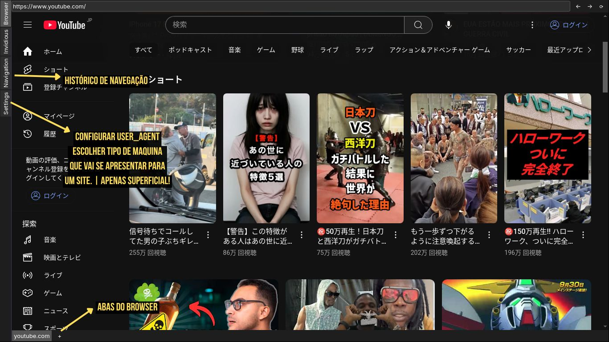
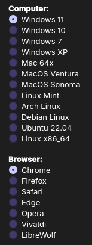

<div align="center">
  
</div>

<h1 align="center">Pac22 Browser ( Open Source )</h1>

# Baseado em ( PySide6 + Qt Engine )

## Instalação de dependências
<p>
<b>| Recomendado uso do Python3 |</b>
</p>


- <b>Arch / Manjaro</b>

Git clone
```bash
git clone https://github.com/danrleyof/pac22-browser.git
```

Instala pacotes do sistema
```bash
sudo pacman -S python-pip python-pillow stem qt6-base qt6-webengine
```

Cria e ativa virtualenv
```bash
python -m venv venv
source venv/bin/activate
```

Instala dependências Python
```bash
pip install PySide6 tldextract
```

Roda o browser
```bash
python3 app.py
```
<br>

- <b>Debian / Ubuntu</b>

Git clone
```bash
git clone https://github.com/danrleyof/pac22-browser.git
```

Instala pacotes do sistema
```bash
sudo apt install python3-pip python3-venv qt6-base-dev qt6-webengine-dev libqt6webengine6
```

Cria e ativa virtualenv
```bash
python3 -m venv venv
source venv/bin/activate
```

Instala dependências Python
```bash
pip install PySide6 tldextract
```

Roda o browser
```bash
python3 app.py
```
<br>

- <b>Windows</b>

Atualmente, o projeto é compatível com o Windows.
No entanto, pode haver lentidão durante o uso, pois não há implementação de drivers específicos para o sistema, sendo que o processamento é realizado diretamente pelo CPU.
<br>
Melhorias futuras podem incluir suporte a drivers nativos para otimizar desempenho no Windows.

<br>

## Novo usuário

<p>
  
**Pasta de Usuário:**

Os dados do usuário são salvos em uma pasta específica que será criada na raiz do seu sistema:
`.pac22_user`
<br>

**Observação:**

Essa pasta armazena configurações e arquivos do usuário. Ela é criada automaticamente na primeira execução do aplicativo e não afeta outros diretórios do sistema.
<br>

<div align="center"></div>
<div align="center"></div>

<br>

## Browser

<div align="center"></div>


<div align="center">

**User Agent**
</div>

<div align="justify">

O `User Agent (UA)` é uma informação que seu navegador envia para o site, dizendo basicamente qual navegador você está usando, qual versão, e qual `sistema operacional (OS)` você possui.
Ele ajuda o site a adaptar o conteúdo para o seu navegador ou dispositivo, como mostrar uma versão mobile ou ativar funcionalidades específicas.

**Importante:** isso não engana o site de verdade. O sistema operacional real do seu computador `ainda será detectado` pelos sites que precisarem dessa informação para rodar funções críticas.
Ou seja, o `User Agent` muda apenas a `superfície`, mas não altera o funcionamento interno do seu `OS`.

No `App.py` você pode alterar o `User Agent (UA)` padrão. <br>
Line 20:
</div>

```bash
USER_AGENT = "Mozilla/5.0 (Windows NT 10.0; Win64; x64; rv:131.0) Gecko/20100101 (KHTML, like Gecko) Firefox/131.0 Windows 10"
```
<br>

## Suporte a Plataformas Protegidas

**Suporte a plataformas protegidas:** Sites como `Netflix, Spotify, Disney+` e outros que exigem `autenticação` ou `DRM` ainda não são totalmente suportados, pois o projeto é novo. Essas funcionalidades serão implementadas nas próximas atualizações.

<br/>

<div align="center">
  
**Não compartilhe suas informações pessoais com empresas.**


[](https://x.com/intent/user?screen_name=danrleyof)
[](https://x.com/intent/user?screen_name=fra_daniell)

</div>

<div align="center">
Made with ❤️ in Brasil [< >]
 </div>
<sub>
Este projeto foi desenvolvido como parte de um trabalho acadêmico de faculdade, tendo como principal objetivo o estudo, aprendizado e experimentação de conceitos de programação.
<br>
O código disponibilizado é Open Source e fornecido exclusivamente para fins educacionais.
</sub>
